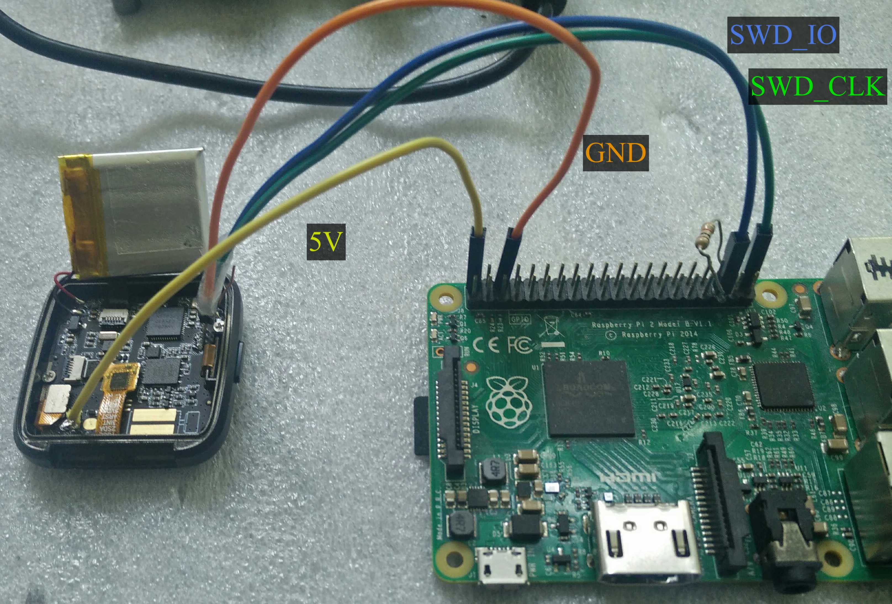
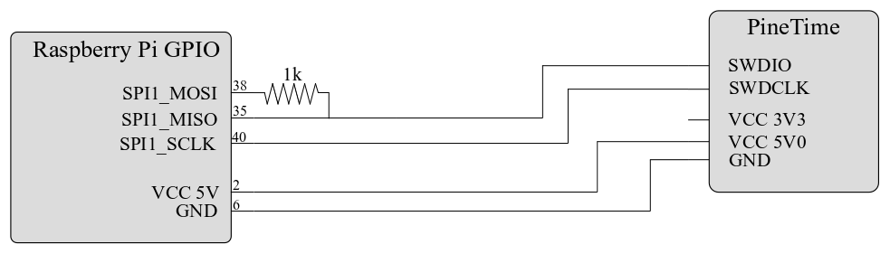

This code is primarily for interacting with a PineTime smart watch with a Raspberry PI.
This setup is a bit unique compared to other PineTime/NRF532832 programming setups that I've seen;
it uses the Raspberry PI's auxillary SPI pins, slightly modded with an external 1k resistor to allow
for bi-directional SPI communication.

The resistor goes between pins 38 and 35 of the raspberry pi's GPIO, connecting the auxillary SPI MOSI
and MISO pins.

This code requires almost no external libraries for programming the NRF,
which is something I personally like quite a lot.
The only exception is that the SWD command line interface requires [linenoise](https://github.com/antirez/linenoise).

This repository has three executables
- `test_mem.c`:
    A small test script to test if SWD IO is working
- `cli.c`:
    A command line interface for doing/debugging SWD stuff
- `flash.c`:
    A script to write the given binary to the NRF's flash memory (starting at address 0x0).
