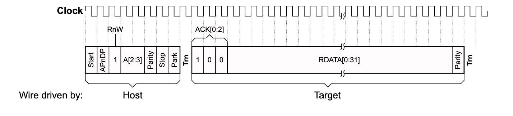
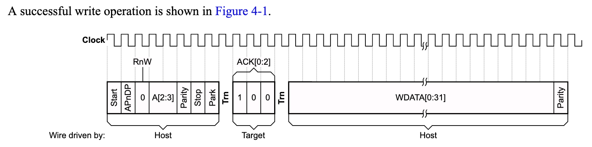
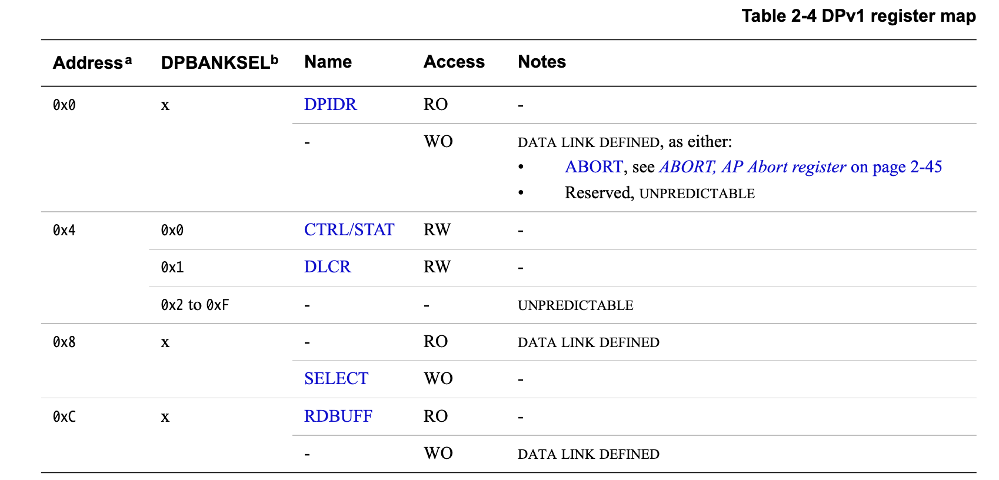
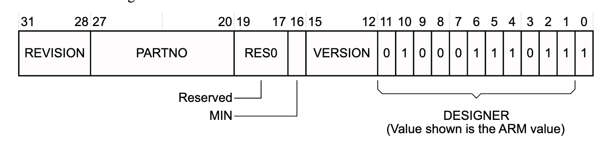
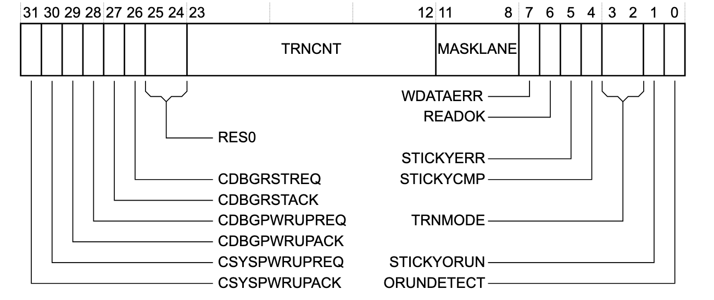
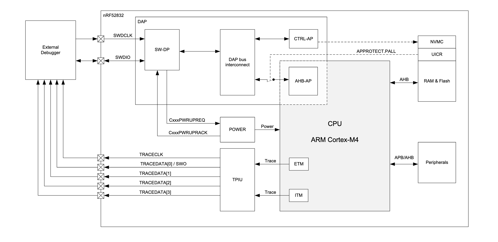
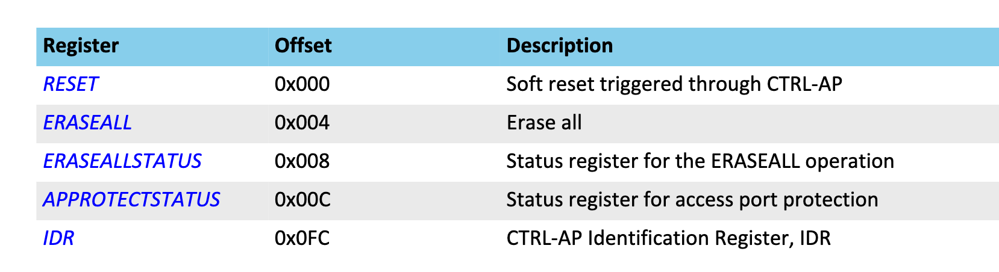
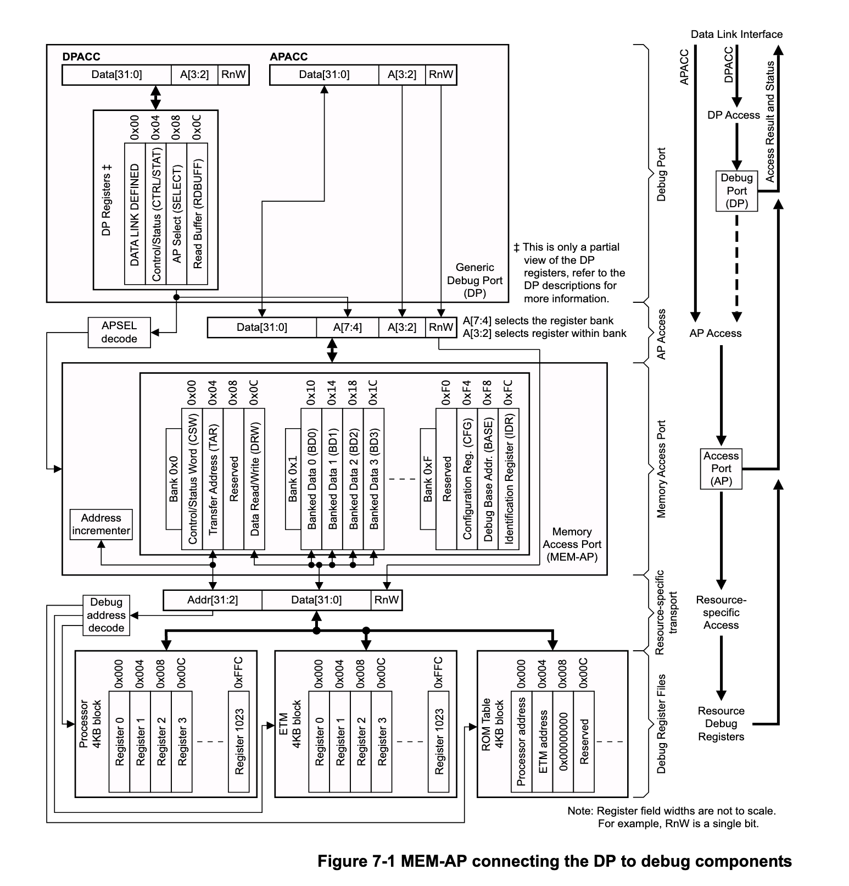
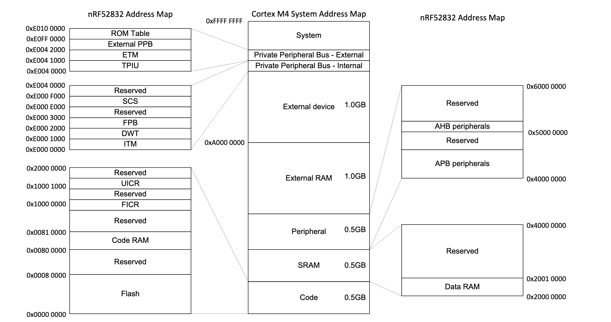
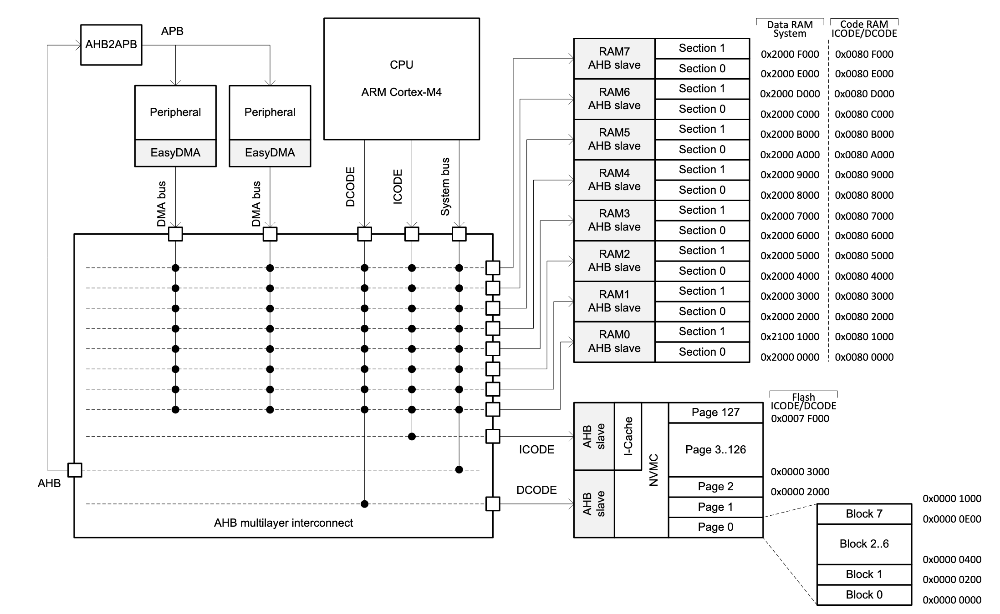

# Notes
I've implemented some code for doing SWD interaction with the NRF52832 on the PineTime using a 
raspberry pi.
I use the first auxillary SPI interface on the raspberry pi to do this, because that interface can
perform arbitrary length SPI transactions. The primary SPI interface must do byte length transfers.
The downside of the auxillary interface is that it cannot do bi-directional data transfers on a single
SPI data pin. To get around this I attached a resistor between the auxillary SPI's MOSI and MISO pins.
Then I attach the SWD data signal to the MISO pin; when the data is going from the RBPI to the NRF that pin
will match the MOSI. When data is going the other way I have the MOSI pin
output a digital HIGH so it acts as a pull up, and the MISO pin will be at whatever value the NRF
specifies.

With that done and tested then the question is about tackling the SWD protocol.
The following images show the SWD packet.

The SWD protocol does this thing where if the APnDP bit is 0 you talk to the
DEBUG PORT (DP), if that bit is 1 you talk to the ACCESS PORT (AP).

Here's a table from the ARM SWD spec that shows the registers that live within
the DP.

You'll notice that bits 2 and 3 of the addr line are the only ones used to specify the address,
and also the only ones specified in the SWD packet.
The DBBANKSEL value is specified by writing to the SELECT register.
Although I basically never need to use anything other than DPBANKSEL=0.
Each register is nominally 32-bits long, although most of the registers don't really use
all 32-bits.

In general (as far as I can tell) you have to talk to the the DP first and read
the DPIDR reg before doing anything else.
Idk why...but you gotta read that reg.

Below is some copy/paste screenshots from the specification for info on the contents
of each resgister

## DP Regs

### DPIDR

### CNTRL/STAT

~IMPORTANT~ the various bits of the CNTRL/STAT reg that are blahblah-REQ are
used to power-up elements of the debug interface. Specifically bits 31 and 28
are necessary. 

### SELECT

### RDBUFF
RDBUFF is just a 32-bit data register that holds the value from the last AP memory
read access.

That basically does it for the DP regs. There exists more that may be at times useful
(like the ABORT reg) but lets not worry about those right now.
Lets move on to the AP regs.
Below is a map of the APs and how they interact with the other NRF elements.

The NRF52 has two seperate APs, selected by the value in the APSEL bits of the DP's SELECT
register.
APSEL=1 is the CTRL-AP and is the simpler one, and it is not a "MEM-AP", it just provides info and utilities for
the NRF but not really any access to memory or device.
Here's the regs/bits available in the CNTRL-AP

Obviously, important here is the ERASEALL register, which is necessary for getting rid of the 
"factory" firmware and unlocking the other AP.
The rest are more or less not so important, maybe the RESET is important once I want to try
flashing new firmware or something like that.

Perhaps worth mentioning here is that the IDR reg exists at address 0xFC. Since the SWD packet only has
address bits 2 & 3 how do you right 0xF to bits 7-4?
The answer is that the top 4 bits is read from the value in the DP's select register in the APBANKSEL
bits.

The second AP (APSEL=0) is the AHB-AP, it provides access to the main memory bus of the whole
chip.
Importantly it is a MEM-AP, most of the properties of a MEM-AP are specified by the ARM debug
interface.
Firstly, all AP's, MEM-AP or otherwise,  are required to have an ID reg at address 0xFC.
Secondly the MEM-AP interaction protocol/map/thing is mostly described by the following figure

The most important regs here are the DRW and TAR.
To get values to and from arbitrary memory locations you write the (32-bit) address in the TAR, the
perform either a read or a write to the DRW.
Reading from the DRW will return the value currently in memory at the TAR address, writing to the DRW
will place the written value in memory at the TAR address.
For reading values from the CSW (or any AP memory access) you need to do the read twice, idk why, but there's
always a lag of one value for memory accesses. 

Worth noting is that I have no idea how the "Debug address decode" works for the NRF...
that may or may not be a huge problem...to be determined.

## NRF Memory
I'm not 100% clear on how the memory for the NRF/Pinetime works. This is still a work-in-progress for
me. So this info is just my current understanding.
Here's a memory map from the NRF data sheet.

And here's how memory is used by the CPU

I BELIEVE the place where my (compiled) code should go is "FLASH".
So, I THINK (THINK!) what I should do is place the binary compiled code is in flash starting at address
0x0 and just going up from there.
I fear there's some need to split instructions and data...idk though dude.
I also fear there's little endian/big endian bullshit that needs to be considered.

I think my plan from here is just squirt the code across the SWD verbatim, starting at 0x0 and going up.
Then doing a RESET (in the CNTRL-AP). Then seeing if things work.
If things work, good...if not I have to do some work.

## Basic steps for getting to memory

1. Perform a JTAG-TO-SWD
2. Perform an SWD RESET
3. Read the DPID
4. Power up the debug bits in the CNTRL/STAT
5. Set the DP's SELECT reg to APSEL=0x1 APBANK=0x0, check the protect status and such
6. Set the DP's SELECT reg to APSEL=0x0 APBANK=0x0
7. Start doing DRW/TAR IO

